# VueSip Architecture Documentation

**Version:** 1.0.0
**Last Updated:** 2025-11-08
**Target Audience:** Developers, Technical Architects, Contributors

> **Note:** If you're looking to contribute to VueSip, please also see our [Contributing Guide](../../CONTRIBUTING.md) for development workflow, coding standards, and PR process.

---

## Table of Contents

1. [System Overview](#system-overview)
2. [Headless Pattern Explained](#headless-pattern-explained)
3. [Layer Architecture](#layer-architecture)
4. [Component Relationships](#component-relationships)
5. [Data Flow Architecture](#data-flow-architecture)
6. [State Management](#state-management)
7. [Plugin Architecture](#plugin-architecture)
8. [WebRTC Integration](#webrtc-integration)
9. [Event System](#event-system)
10. [Storage Architecture](#storage-architecture)
11. [Key Design Decisions](#key-design-decisions)
12. [Performance Considerations](#performance-considerations)
13. [Security Architecture](#security-architecture)

---

## System Overview

### Purpose and Vision

VueSip is a headless Vue.js component library that provides comprehensive SIP (Session Initiation Protocol) and WebRTC functionality for building modern VoIP applications. The library follows a headless UI pattern, completely separating business logic from presentation, allowing developers maximum flexibility in implementing custom user interfaces while leveraging robust communication features.

### Core Principles

1. **Headless Architecture**: Zero UI rendering from library components - all functionality exposed via composables
2. **Type Safety First**: Built with TypeScript from the ground up with comprehensive type definitions
3. **Composable-Driven**: Leverages Vue 3 Composition API for maximum flexibility and reusability
4. **Event-Driven**: Comprehensive event system for reactive state management and extensibility
5. **Production Ready**: Includes security, performance optimization, and comprehensive error handling
6. **Developer Experience**: Clear APIs, comprehensive documentation, and extensive testing

### Technology Stack

- **Vue.js 3.4+**: Core framework using Composition API
- **TypeScript 5.0+**: Type safety and developer experience
- **JsSIP 3.10+**: SIP protocol implementation (via adapter pattern)
- **WebRTC**: Native browser APIs for media handling
- **Vite 5.0+**: Build tool and development server

> **Note on SIP Library Support:** VueSip is designed to support multiple SIP libraries (JsSIP, SIP.js, etc.) through an adapter pattern. Currently, JsSIP is the implemented adapter. See [Adapter Architecture](../../src/adapters/README.md) and [Adapter Roadmap](../../ADAPTER_ROADMAP.md) for details on multi-library support.

---

## Headless Pattern Explained

### What is a Headless Component?

A headless component provides business logic, state management, and behavior without prescribing any specific UI implementation. In VueSip, this means:

- **No DOM Rendering**: Components don't render any HTML elements
- **Logic Only**: All functionality is exposed through JavaScript/TypeScript APIs
- **UI Agnostic**: Works with any UI framework or custom implementation
- **State Exposure**: Reactive state is exposed via Vue's reactivity system
- **Method Exposure**: All operations are available as methods

### Benefits of Headless Architecture

1. **Maximum Flexibility**: Developers have complete control over UI/UX
2. **Framework Agnostic Core**: Core logic can potentially be adapted to other frameworks
3. **Separation of Concerns**: Clean separation between business logic and presentation
4. **Easier Testing**: Logic can be tested independently of UI
5. **Smaller Bundle Size**: No CSS or UI component overhead
6. **Accessibility Control**: Developers can implement ARIA and accessibility as needed

### Implementation in VueSip

```typescript
// Headless composable - no UI rendering
export function useCallSession() {
  // Internal state (reactive)
  const callState = ref<CallState>('idle')
  const remoteUri = ref<string | null>(null)

  // Exposed methods (business logic)
  const makeCall = async (target: string) => {
    // Implementation
  }

  const hangup = async () => {
    // Implementation
  }

  // Return state and methods (no template/rendering)
  return {
    // Reactive state
    callState,
    remoteUri,
    // Methods
    makeCall,
    hangup
  }
}
```

Developers consume this in their own components:

```vue
<template>
  <!-- Developer has complete control over UI -->
  <div class="my-custom-ui">
    <p>Call Status: {{ callState }}</p>
    <button @click="makeCall('sip:user@domain')">Call</button>
    <button @click="hangup">Hang Up</button>
  </div>
</template>

<script setup>
import { useCallSession } from 'vuesip'

// Get state and methods
const { callState, makeCall, hangup } = useCallSession()
</script>
```

---

## Layer Architecture

VueSip follows a four-layer architecture that cleanly separates concerns and establishes clear boundaries between different aspects of the system.

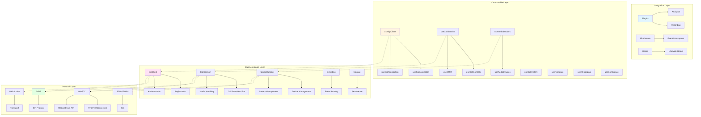

### Layer 1: Protocol Layer

The **Protocol Layer** handles low-level communication protocols and browser APIs.

**Responsibilities:**
- SIP protocol implementation via SIP libraries (JsSIP, SIP.js, etc.)
- WebRTC peer connection management
- WebSocket transport for SIP signaling
- ICE candidate gathering via STUN/TURN servers
- Media stream acquisition and management

**Key Components:**
- `ISipAdapter`: Adapter interface for SIP library abstraction
- `JsSIP UA`: User Agent for SIP communication (via JsSipAdapter)
- `RTCPeerConnection`: WebRTC connection object
- `MediaStream API`: Browser media access
- `WebSocket`: Signaling transport
- `STUN/TURN`: NAT traversal

**Isolation:**
This layer is completely isolated from Vue and application logic through the adapter pattern. Different SIP libraries can be used by implementing the `ISipAdapter` interface. See [Adapter Architecture](../../src/adapters/README.md) for details.

> **SIP Library Adapters:** VueSip uses an adapter pattern to support multiple SIP libraries. Currently implemented: JsSIP. Planned: SIP.js. See [Adapter Roadmap](../../ADAPTER_ROADMAP.md).

### Layer 2: Business Logic Layer

The **Business Logic Layer** wraps protocol implementations in application-specific logic.

**Responsibilities:**
- Call lifecycle management
- Registration and authentication
- Media device management
- Event propagation
- State persistence
- Call history tracking

**Key Components:**

1. **SipClient** (`src/core/SipClient.ts`)
   - Wraps JsSIP User Agent
   - Manages SIP registration
   - Handles authentication (Digest MD5, HA1)
   - Emits SIP-related events

2. **CallSession** (`src/core/CallSession.ts`)
   - Manages individual call sessions
   - Tracks call state transitions
   - Handles call timing and metadata
   - Manages media streams for calls

3. **MediaManager** (`src/core/MediaManager.ts`)
   - Manages RTCPeerConnection lifecycle
   - Handles ICE negotiation
   - Manages local and remote media streams
   - Enumerates and manages media devices

4. **EventBus** (`src/core/EventBus.ts`)
   - Centralized event system
   - Type-safe event emission
   - Wildcard event support
   - Async handler support

5. **TransportManager** (`src/core/TransportManager.ts`)
   - WebSocket connection management
   - Automatic reconnection with exponential backoff
   - Keep-alive mechanism
   - Connection state tracking

**Design Pattern:**
Uses the Facade pattern to provide a clean interface to complex protocol implementations while adding application-specific behavior.

### Layer 3: Composable Layer

The **Composable Layer** exposes functionality to Vue applications via composables.

**Responsibilities:**
- Expose reactive state to components
- Provide methods for SIP operations
- Manage component-level lifecycle
- Integrate with Vue's reactivity system
- Handle dependency injection via provide/inject

**Key Composables:**

1. **useSipClient** - Main SIP client connection and registration
2. **useSipConnection** - SIP connection state management
3. **useSipRegistration** - Independent registration management
4. **useCallSession** - Individual call session management
5. **useCallControls** - Call control features (hold, mute, transfer)
6. **useMediaDevices** - Media device enumeration and selection
7. **useDTMF** - DTMF tone generation
8. **useCallHistory** - Call history management with persistence
9. **usePresence** - SIP SIMPLE presence
10. **useMessaging** - SIP MESSAGE method
11. **useConference** - Multi-party conferencing

**Design Pattern:**
Follows Vue 3 Composition API patterns with `use*` naming convention, returning objects with reactive state and methods.

### Layer 4: Integration Layer

The **Integration Layer** provides extensibility and customization points.

**Responsibilities:**
- Plugin system for extending functionality
- Middleware for event interception
- Lifecycle hooks for custom behavior
- Analytics integration
- Recording and transcription plugins

**Key Components:**

1. **PluginManager** - Manages plugin lifecycle
2. **HookManager** - Manages lifecycle hooks
3. **AnalyticsPlugin** - Analytics integration
4. **RecordingPlugin** - Call recording

**Design Pattern:**
Uses the Observer pattern for hooks and the Strategy pattern for plugins.

---

## Component Relationships

### Dependency Graph

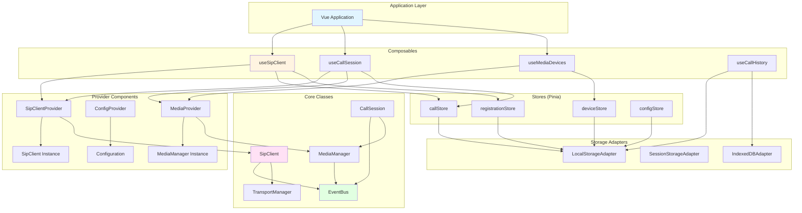

### Component Communication Patterns

#### 1. Provider Pattern

Providers inject global instances into the Vue component tree:

```typescript
// SipClientProvider creates a singleton SipClient
<SipClientProvider :config="sipConfig">
  <App />
</SipClientProvider>
```

Inside components:

```typescript
// Composable accesses injected instance
const sipClient = inject<SipClient>(SIP_CLIENT_KEY)
```

#### 2. Event-Driven Communication

Components communicate via the EventBus:

```typescript
// Component A emits event
eventBus.emit('call:incoming', { callId, remoteUri })

// Component B listens
eventBus.on('call:incoming', (payload) => {
  // Handle incoming call
})
```

#### 3. Reactive State Sharing

Pinia stores provide reactive global state:

```typescript
// Store definition
export const useCallStore = defineStore('call', () => {
  const activeCalls = ref<Map<string, CallSession>>(new Map())

  return { activeCalls }
})

// Usage in composable
const callStore = useCallStore()
callStore.activeCalls.set(callId, session)
```

### Dependency Injection Strategy

VueSip uses Vue's provide/inject for dependency injection:

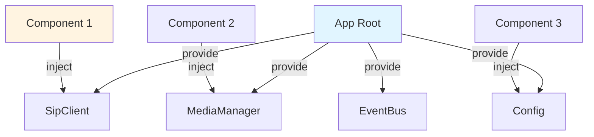

**Benefits:**
- Singleton instances shared across application
- No prop drilling
- Easy to mock for testing
- Optional instances (graceful degradation)

---

## Data Flow Architecture

### Complete Call Flow

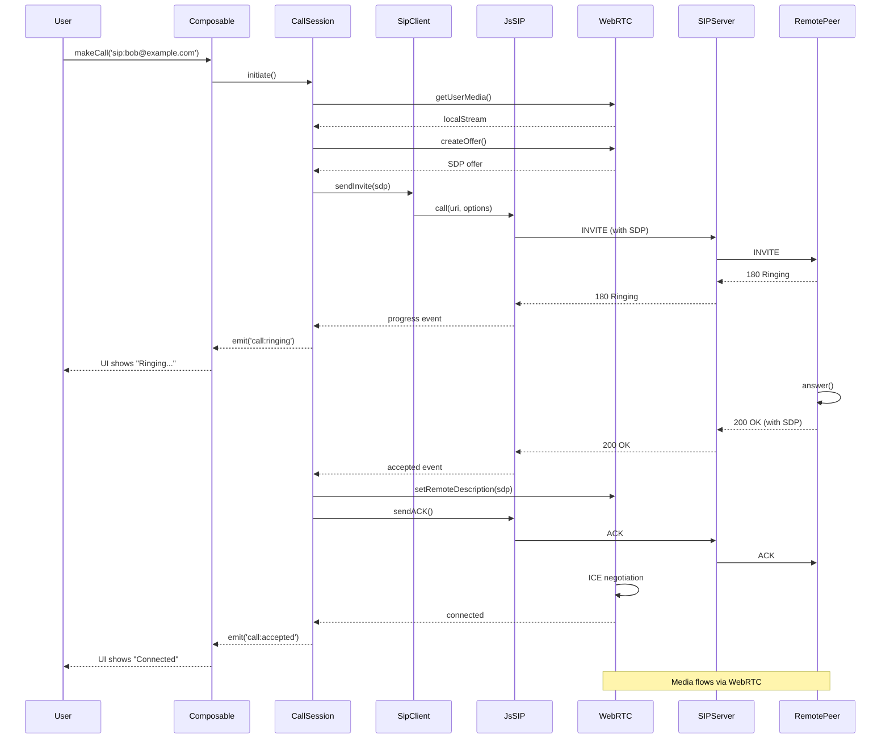

### Registration Flow

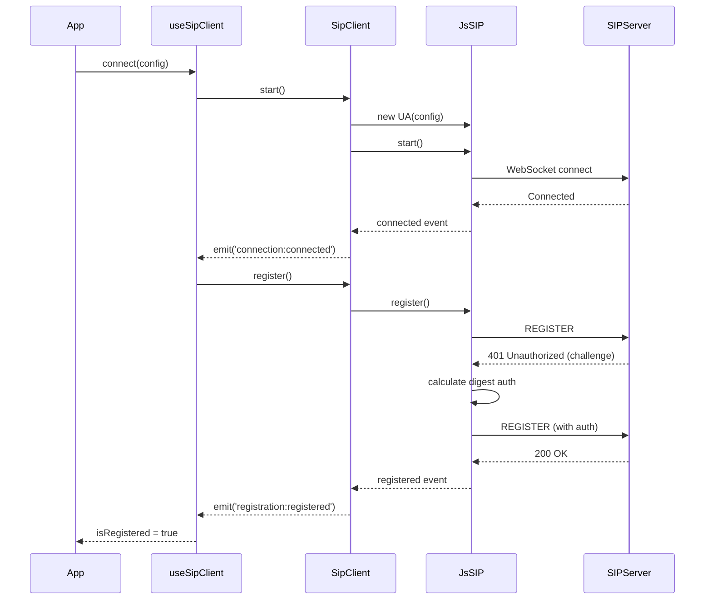

### State Update Flow

```mermaid
graph LR
    A[User Action] --> B[Composable Method]
    B --> C[Core Class Method]
    C --> D[Protocol Layer]
    D --> E[State Change]
    E --> F[EventBus.emit]
    F --> G[Store Update]
    G --> H[Vue Reactivity]
    H --> I[UI Update]

    style A fill:#e1f5ff
    style B fill:#fff4e1
    style C fill:#ffe1f5
    style D fill:#e1ffe1
    style I fill:#e1f5ff
```

### Media Stream Flow

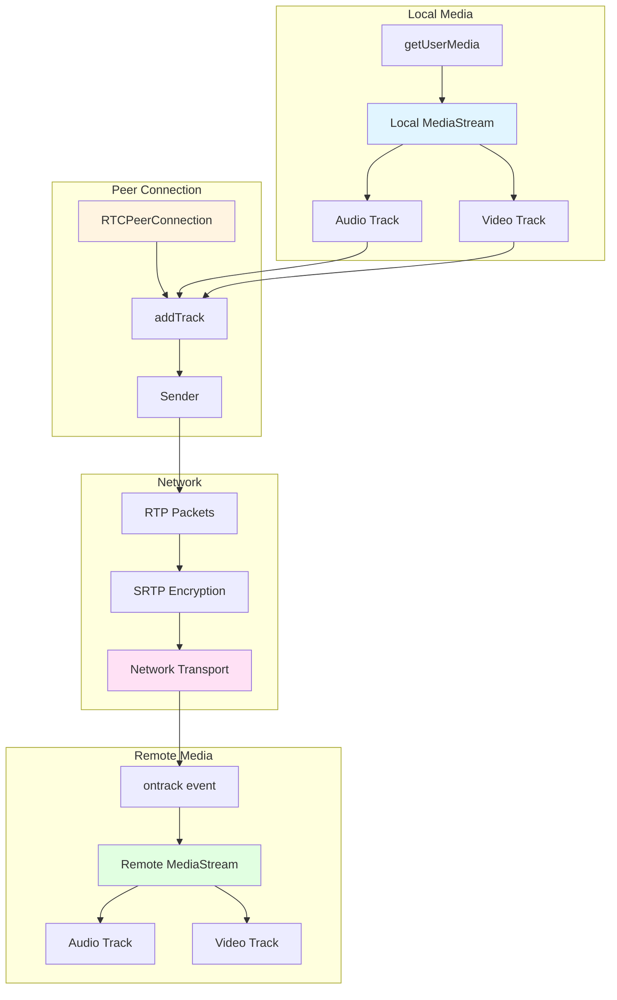

---

## State Management

### Multi-Layer State Architecture

VueSip uses a multi-layer state management approach:

1. **Component-Level State**: Individual composable state (refs, reactive objects)
2. **Global Application State**: Pinia stores for shared state
3. **Persistent State**: Storage adapters for persistence

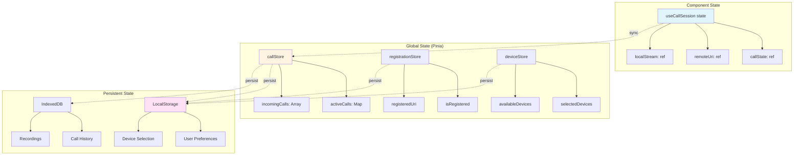

### State Synchronization

**Component to Store:**
```typescript
// In composable
const callStore = useCallStore()

watch(callState, (newState) => {
  // Update store when component state changes
  callStore.updateCallState(callId, newState)
})
```

**Store to Persistence:**
```typescript
// In store
const { persist } = usePersistence({
  key: 'vuesip:calls',
  storage: localStorage,
  paths: ['activeCalls', 'callHistory']
})
```

**Event-Driven Updates:**
```typescript
// State updates trigger events
eventBus.on('call:stateChanged', ({ callId, state }) => {
  callStore.updateCallState(callId, state)
})
```

### State Persistence Strategy

**LocalStorage** (5-10MB limit):
- User preferences (audio/video settings)
- Device selections
- SIP configuration (encrypted)
- Registration state

**SessionStorage** (5-10MB limit):
- Temporary session data
- Active call metadata
- Connection state

**IndexedDB** (50MB-500MB+):
- Call history (large datasets)
- Call recordings (binary data)
- Message history
- Presence cache

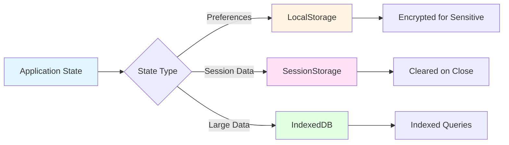

---

## Plugin Architecture

### Plugin System Design

VueSip includes a flexible plugin system for extending functionality without modifying core code.

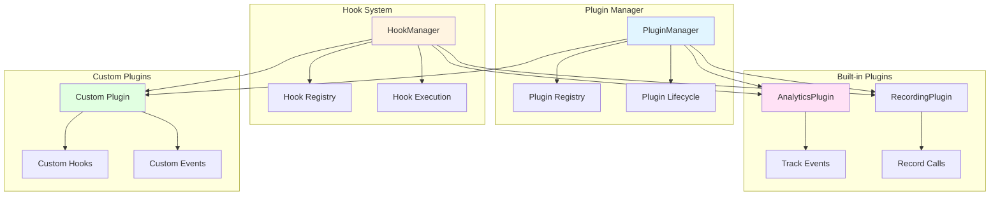

### Plugin Interface

```typescript
interface Plugin {
  name: string
  version: string
  install(context: PluginContext): void | Promise<void>
  uninstall?(): void | Promise<void>
}

interface PluginContext {
  eventBus: EventBus
  hooks: HookRegistry
  config: Configuration
}
```

### Hook System

Available lifecycle hooks:

- `beforeConnect` - Before SIP connection
- `afterConnect` - After successful connection
- `beforeRegister` - Before SIP registration
- `afterRegister` - After successful registration
- `beforeCall` - Before initiating a call
- `afterCall` - After call connected
- `beforeAnswer` - Before answering incoming call
- `afterAnswer` - After call answered
- `beforeHangup` - Before call termination
- `afterHangup` - After call terminated
- `onError` - On any error

**Hook Execution:**
```typescript
// Register hook
hooks.register('beforeCall', async (context) => {
  // Pre-call validation
  if (!context.permissions.granted) {
    throw new Error('Permissions not granted')
  }
})

// Execute hooks
await hooks.execute('beforeCall', context)
```

### Analytics Plugin Example

```typescript
export class AnalyticsPlugin implements Plugin {
  name = 'analytics'
  version = '1.0.0'

  install(context: PluginContext) {
    const { eventBus, hooks } = context

    // Track call events
    eventBus.on('call:*', (event) => {
      this.trackEvent('call', event.type, event.data)
    })

    // Track registration
    hooks.register('afterRegister', () => {
      this.trackEvent('registration', 'success')
    })
  }

  private trackEvent(category: string, action: string, data?: any) {
    // Send to analytics service
    console.log(`[Analytics] ${category}:${action}`, data)
  }
}
```

### Recording Plugin Example

```typescript
export class RecordingPlugin implements Plugin {
  name = 'recording'
  version = '1.0.0'
  private recorder: MediaRecorder | null = null

  install(context: PluginContext) {
    const { eventBus } = context

    eventBus.on('call:accepted', ({ session }) => {
      if (session.remoteStream) {
        this.startRecording(session.remoteStream)
      }
    })

    eventBus.on('call:terminated', () => {
      this.stopRecording()
    })
  }

  private startRecording(stream: MediaStream) {
    this.recorder = new MediaRecorder(stream)
    this.recorder.start()
  }

  private stopRecording() {
    if (this.recorder && this.recorder.state !== 'inactive') {
      this.recorder.stop()
    }
  }
}
```

---

## WebRTC Integration

### WebRTC Architecture

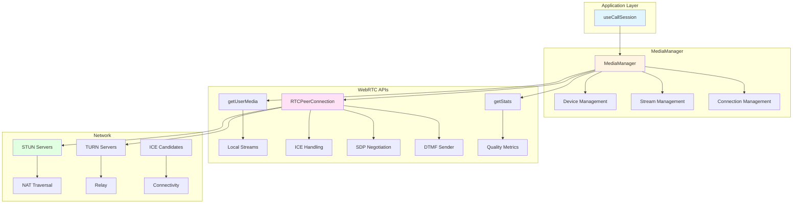

### ICE Negotiation Flow

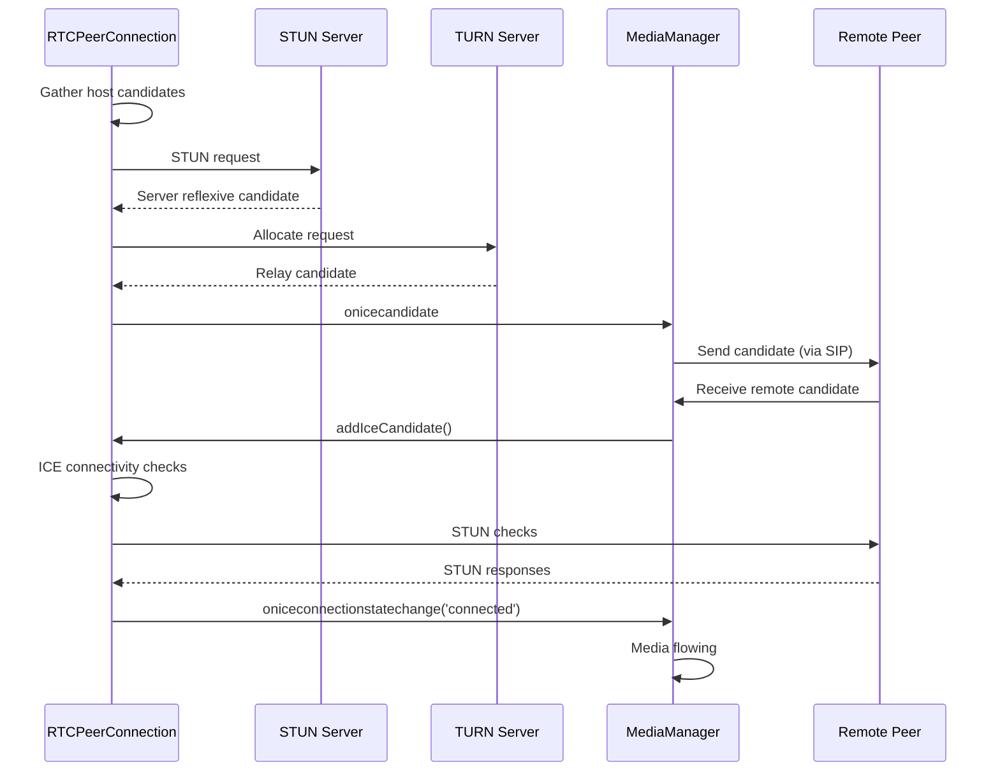

### Media Constraints and Quality

**Default Audio Constraints:**
```typescript
{
  audio: {
    echoCancellation: true,
    noiseSuppression: true,
    autoGainControl: true,
    sampleRate: 48000,
    channelCount: 1
  }
}
```

**Default Video Constraints:**
```typescript
{
  video: {
    width: { ideal: 640, max: 1280 },
    height: { ideal: 480, max: 720 },
    frameRate: { ideal: 30, max: 30 },
    facingMode: 'user'
  }
}
```

### Codec Preference

**Audio Codecs** (priority order):
1. Opus (48 kHz, variable bitrate) - Preferred
2. G.722 (16 kHz wideband)
3. PCMU (G.711 µ-law, 8 kHz)
4. PCMA (G.711 A-law, 8 kHz)

**Video Codecs** (priority order):
1. H.264 (if available) - Preferred
2. VP9
3. VP8 (fallback)

### Statistics Collection

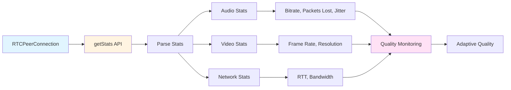

**Quality Adaptation:**
- Monitor packet loss > 5%: Reduce bitrate
- Monitor RTT > 300ms: Reduce resolution/framerate
- Monitor available bandwidth: Adjust codec parameters

---

## Event System

### EventBus Architecture

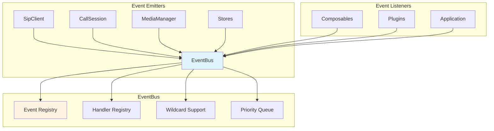

### Event Categories

**Connection Events:**
- `connection:connecting`
- `connection:connected`
- `connection:disconnected`
- `connection:failed`
- `connection:reconnecting`

**Registration Events:**
- `registration:registering`
- `registration:registered`
- `registration:unregistered`
- `registration:failed`
- `registration:expiring`

**Call Events:**
- `call:incoming`
- `call:outgoing`
- `call:ringing`
- `call:progress`
- `call:accepted`
- `call:answered`
- `call:held`
- `call:unheld`
- `call:muted`
- `call:unmuted`
- `call:terminated`
- `call:failed`

**Media Events:**
- `media:deviceChanged`
- `media:deviceAdded`
- `media:deviceRemoved`
- `media:streamAdded`
- `media:streamRemoved`
- `media:trackAdded`
- `media:trackRemoved`

### Event Payload Structure

```typescript
interface EventPayload<T> {
  type: string              // Event type (e.g., 'call:incoming')
  timestamp: Date          // When event occurred
  data: T                  // Event-specific data
  metadata?: Record<string, unknown>  // Optional metadata
}
```

### Wildcard Event Listening

```typescript
// Listen to all call events
eventBus.on('call:*', (event) => {
  console.log('Call event:', event.type)
})

// Listen to all events
eventBus.on('*', (event) => {
  console.log('Any event:', event.type)
})
```

### Async Event Handlers

```typescript
eventBus.on('call:incoming', async (event) => {
  // Async operations supported
  await checkUserAvailability()
  await logIncomingCall(event.data)
})
```

### Event Priority

```typescript
// High priority handler (executes first)
eventBus.on('call:incoming', handler1, { priority: 10 })

// Normal priority (executes later)
eventBus.on('call:incoming', handler2, { priority: 0 })
```

---

## Storage Architecture

### Storage Layer Design

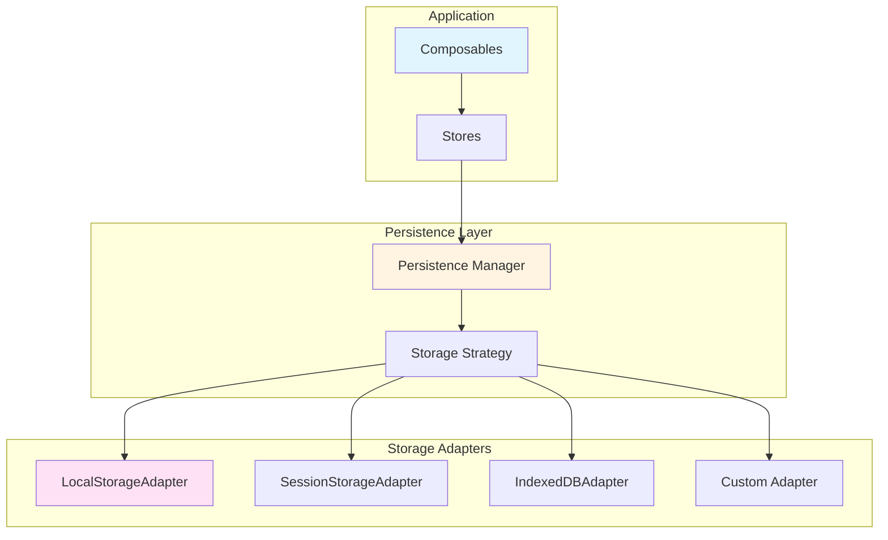

### Storage Adapter Interface

```typescript
interface StorageAdapter {
  get<T>(key: string): Promise<T | null>
  set<T>(key: string, value: T): Promise<void>
  remove(key: string): Promise<void>
  clear(): Promise<void>
  has(key: string): Promise<boolean>
}
```

### LocalStorage Adapter

**Use Cases:**
- User preferences
- Device selections
- SIP configuration (encrypted)
- UI state

**Implementation:**
```typescript
export class LocalStorageAdapter implements StorageAdapter {
  async get<T>(key: string): Promise<T | null> {
    const item = localStorage.getItem(key)
    return item ? JSON.parse(item) : null
  }

  async set<T>(key: string, value: T): Promise<void> {
    localStorage.setItem(key, JSON.stringify(value))
  }
}
```

### IndexedDB Adapter

**Use Cases:**
- Call history (large datasets)
- Call recordings (binary data)
- Message history
- Offline data cache

**Schema:**
```typescript
// Database: vuesip
// Version: 1

// Object Store: callHistory
{
  keyPath: 'id',
  indexes: [
    { name: 'remoteUri', keyPath: 'remoteUri' },
    { name: 'startTime', keyPath: 'startTime' },
    { name: 'direction', keyPath: 'direction' }
  ]
}

// Object Store: recordings
{
  keyPath: 'id',
  indexes: [
    { name: 'callId', keyPath: 'callId' },
    { name: 'timestamp', keyPath: 'timestamp' }
  ]
}
```

### Encryption for Sensitive Data

```typescript
// Encrypt SIP credentials before storage
const encrypted = await encrypt(credentials, userKey)
await storage.set('vuesip:credentials', encrypted)

// Decrypt on retrieval
const encrypted = await storage.get('vuesip:credentials')
const credentials = await decrypt(encrypted, userKey)
```

**Encryption Method:**
- Web Crypto API (SubtleCrypto)
- AES-GCM algorithm
- PBKDF2 key derivation
- Random IV per encryption

---

## Key Design Decisions

### 1. Headless Architecture Choice

**Decision:** Build as headless library with zero UI components

**Rationale:**
- Maximum flexibility for developers
- Smaller bundle size (no CSS/UI overhead)
- Easier to maintain (no UI testing)
- Framework agnostic core logic
- Better separation of concerns

**Trade-offs:**
- Higher barrier to entry for beginners
- No ready-to-use UI components
- More work for developers initially

### 2. Vue 3 Composition API

**Decision:** Use Composition API exclusively (no Options API)

**Rationale:**
- Better TypeScript support
- More flexible code organization
- Easier code reuse
- Better tree-shaking
- Aligns with Vue 3 best practices

**Trade-offs:**
- Requires Vue 3.4+
- Learning curve for Vue 2 developers
- No Options API compatibility

### 3. JsSIP as SIP Library (Current Default)

**Decision:** Use JsSIP as primary SIP implementation with adapter pattern for library flexibility

**Rationale:**
- Mature and battle-tested
- Active maintenance
- Good WebRTC integration
- Comprehensive SIP support
- Browser-native implementation

**Alternatives Considered:**
- SIP.js (more complex, larger bundle) - **Supported via adapter pattern**
- Custom implementation (too much effort)

**Future Support:**
VueSip uses an adapter pattern (see [Adapter Architecture](../../src/adapters/README.md)) that allows runtime selection of SIP libraries. JsSIP is currently the default and only implemented adapter, but SIP.js support is planned. This provides library flexibility without changing application code.

### 4. Event-Driven Architecture

**Decision:** Centralized EventBus for all events

**Rationale:**
- Loose coupling between components
- Easy to extend with plugins
- Clear event flow
- Support for middleware
- Better debugging

**Trade-offs:**
- More memory usage (event listeners)
- Potential for memory leaks if not cleaned up
- Less explicit than direct method calls

### 5. Multi-Layer State Management

**Decision:** Component state + Pinia stores + Persistence

**Rationale:**
- Component state for local concerns
- Global state for shared data
- Persistence for durability
- Vue reactivity throughout

**Alternatives Considered:**
- Vue's provide/inject only (not reactive enough)
- Vuex (deprecated in favor of Pinia)
- External state management (breaks Vue integration)

### 6. TypeScript First

**Decision:** Built entirely in TypeScript with strict mode

**Rationale:**
- Better developer experience
- Catch errors at compile time
- Self-documenting code
- Better IDE support
- Industry standard

**Trade-offs:**
- Larger development overhead
- Compilation required
- Generic complexity

### 7. Plugin System

**Decision:** Extensible plugin architecture with hooks

**Rationale:**
- Core stays focused and small
- Easy to add features without modifying core
- Community can contribute plugins
- Better testability

**Alternatives Considered:**
- Monolithic design (harder to maintain)
- Inheritance-based (less flexible)

---

## Performance Considerations

### Bundle Size Optimization

**Targets:**
- Minified: < 150 KB
- Gzipped: < 50 KB

**Techniques:**
1. Tree-shaking (ESM exports)
2. Code splitting (dynamic imports)
3. Lazy loading optional features
4. Minimal dependencies
5. Terser minification

### Runtime Performance

**Targets:**
- Call setup: < 2 seconds
- State update: < 50ms
- Event propagation: < 10ms
- Memory per call: < 50 MB

**Optimizations:**
1. Object pooling for frequent allocations
2. Debounce/throttle for high-frequency events
3. Virtual scrolling for call history
4. Lazy initialization of heavy objects
5. WeakMap for metadata storage

### Memory Management

**Strategies:**
1. Automatic cleanup on call termination
2. Event listener removal on unmount
3. Stream track disposal
4. PeerConnection closure
5. Store cleanup for terminated calls

**Memory Leak Prevention:**
```typescript
// Always clean up in onUnmounted
onUnmounted(() => {
  // Remove event listeners
  eventBus.off('call:*', handler)

  // Stop media tracks
  localStream?.getTracks().forEach(track => track.stop())

  // Close peer connection
  peerConnection?.close()
})
```

### Network Optimization

**Techniques:**
1. Connection pooling (single WebSocket)
2. Keep-alive to prevent reconnections
3. Compression support
4. Adaptive bitrate for media
5. ICE candidate optimization

---

## Security Architecture

### Transport Security

**Requirements:**
- WSS (WebSocket Secure) mandatory for production
- TLS 1.2 minimum, TLS 1.3 preferred
- Certificate validation
- DTLS-SRTP for media encryption

### Authentication

**SIP Digest Authentication:**
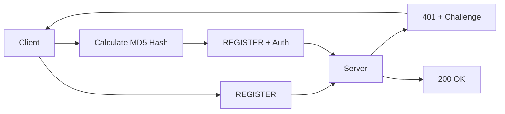

**Supported Methods:**
- Digest Authentication (MD5)
- HA1 hash support
- Authorization username override
- Realm handling

### Credential Storage

**Best Practices:**
1. Never store passwords in plain text
2. Use Web Crypto API for encryption
3. PBKDF2 for key derivation
4. Random IV per encryption
5. Clear credentials on logout

```typescript
// Encrypt credentials before storage
const key = await deriveKey(userPassword)
const encrypted = await encrypt(credentials, key)
localStorage.setItem('vuesip:creds', encrypted)
```

### Input Validation

**Validation Points:**
1. SIP URI format validation
2. Phone number validation
3. Header injection prevention
4. XSS prevention in display names
5. Path traversal prevention

### Content Security Policy

**Recommended CSP:**
```
default-src 'self';
connect-src 'self' wss://sip.example.com;
media-src 'self' blob:;
script-src 'self';
```

---

## Conclusion

VueSip's architecture is designed for:

1. **Flexibility**: Headless pattern gives developers complete UI control
2. **Maintainability**: Clean layer separation and clear responsibilities
3. **Extensibility**: Plugin system allows customization without core modifications
4. **Performance**: Optimized for production use with careful resource management
5. **Security**: Built-in security best practices and encryption
6. **Developer Experience**: TypeScript-first with comprehensive types and documentation

The four-layer architecture (Protocol → Business Logic → Composable → Integration) provides clear separation of concerns while the event-driven design enables loose coupling and extensibility. This foundation supports building robust, production-ready VoIP applications with Vue.js.

---

## Additional Resources

- **Adapter Architecture**: `/src/adapters/README.md` - Multi-library SIP support design
- **Adapter Roadmap**: `/ADAPTER_ROADMAP.md` - Implementation plan for SIP library adapters
- **Technical Specifications**: `/TECHNICAL_SPECIFICATIONS.md`
- **Contributing Guide**: `/CONTRIBUTING.md` - Developer guidelines and workflow
- **API Documentation**: `/docs/api/`
- **User Guides**: `/docs/guide/`
- **Testing Guide**: `/docs/testing-guide.md`
- **Examples**: `/examples/` and `/playground/`

---

**Document Revision:** 1.0.0
**Authors:** VueSip Development Team
**Last Review:** 2025-11-08
